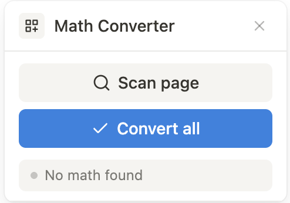

# Notion Math Converter

A Tampermonkey userscript that automatically converts LaTeX math notation into native Notion equation blocks.

This project builds upon and improves the [Notion Formula Auto Conversion Tool](https://github.com/skyance/Notion-Formula-Auto-Conversion-Tool/blob/main/Notion-Formula-Auto-Conversion-Tool.js) by skyance.

## What it does

When you paste LaTeX math into Notion (e.g. from ChatGPT, textbooks, or notes), the math delimiters and content end up as plain text spread across multiple blocks. This script detects those patterns and converts them into proper Notion equation blocks.

Supported formats:

- **Multi-line `[ ... ]` blocks** -- a `[` on its own line, followed by lines of LaTeX, closed by `]`
- **Single-line `[ ... ]` blocks** -- e.g. `[ \frac{a}{b} = c ]`
- **Multi-line `$$ ... $$` blocks** -- `$$` on its own line, LaTeX lines, then `$$`
- **Single-line `$$ ... $$` blocks** -- e.g. `$$ E = mc^2 $$`

## Improvements over the original

- **Safe block selection** -- selects only the target block's contents instead of using `selectAll`, which would wipe the entire Notion page
- **Multi-line support** -- handles math that spans multiple Notion blocks, deleting the extra blocks bottom-up and converting the first into an equation
- **Scan (dry run) mode** -- preview what the script detects before converting anything
- **`$$ ... $$` support** -- recognizes double-dollar delimiters in addition to bracket notation
- **Floating UI panel** -- a small fixed panel with Scan and Convert buttons, status display, and a scrollable log
- **Iterative conversion** -- processes one group at a time with fresh DOM scans between each, avoiding stale references

## Installation

1. Install the [Tampermonkey](https://www.tampermonkey.net/) browser extension
2. Click the Tampermonkey icon and select **Create a new script**
3. Delete the template code and paste the contents of `script.js`
4. Save the script (Ctrl+S / Cmd+S)

## Usage

1. Open a Notion page that contains pasted LaTeX math
2. A small **Math Converter v6.1** panel appears in the top-right corner
3. Click **SCAN (dry run)** to see which math blocks are detected and preview the LaTeX that will be used
4. Click **CONVERT** to replace the detected blocks with native Notion equation blocks
5. The status bar and log show progress and any issues

## Configuration

Timing delays at the top of the script can be adjusted if conversions are unreliable on slower connections:

| Constant | Default | Purpose |
|---|---|---|
| `MENU_DELAY` | 900ms | Wait for Notion's `/math` slash command menu to appear |
| `ACTION_DELAY` | 80ms | Pause between small DOM actions |
| `SETTLE_DELAY` | 500ms | Pause after each conversion for the DOM to stabilize |

## License

MIT
